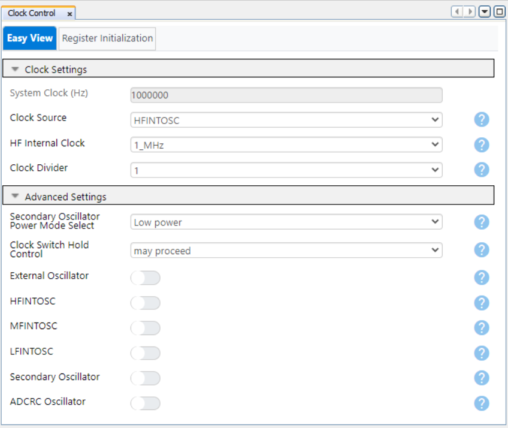
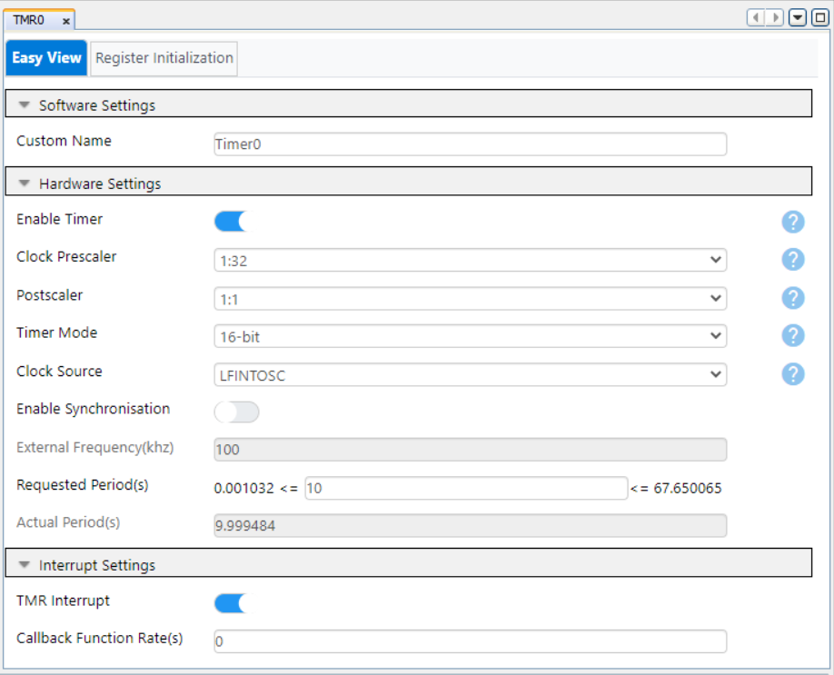
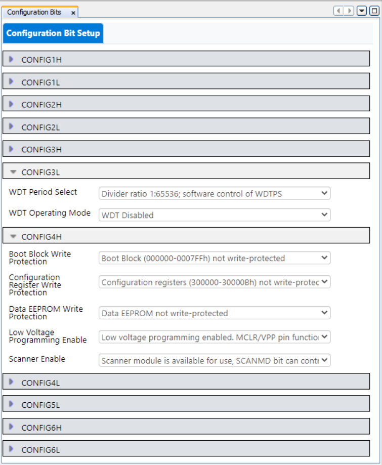
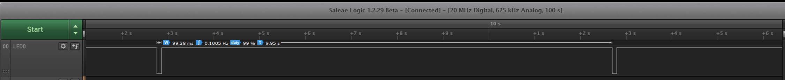
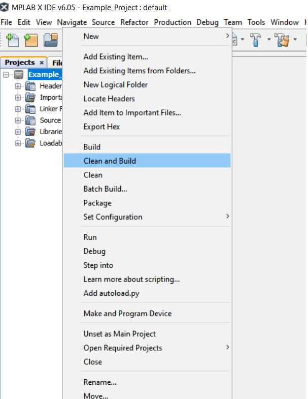
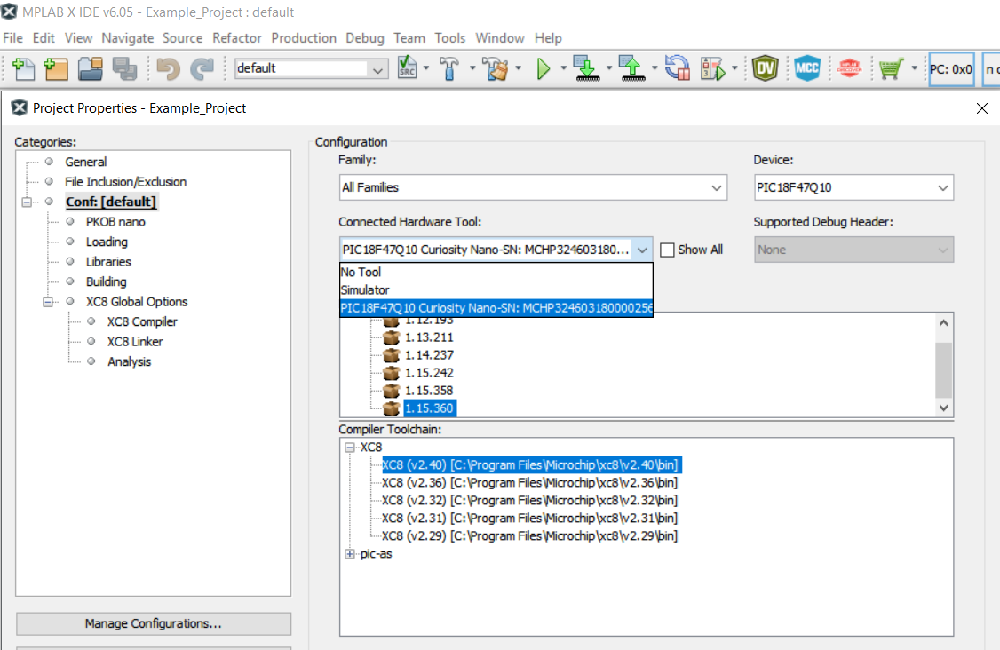

# Timer0 in 16-bit Mode with Periodic Interrupt using the PIC18F47Q10 Microcontroller with MCC Melody

This repository contains an example of MCC Melody-generated source code for Timer0 (TMR0) as described in [TB3285 - Getting Started with Timers/Counters on PIC18](https://www.microchip.com/wwwappnotes/appnotes.aspx?appnote=en1003329) document from Microchip. This example shows how to configure the TMR0 in 16-bit mode, and generate an overflow interrupt every 10 seconds, using LFINOSC as a clock source. TMR0 runs while the microcontroller (MCU) is in Sleep mode. 

 A GPIO pin (the development board’s on-board LED) will be configured as output and when the interrupt occurs, the microcontroller is woken up, the LED is lit for 100 ms and then the microcontroller is put back in Sleep mode.

 The code was generated using MPLAB® Code Configurator.

## Related Documentation
- [TB3285 - Getting Started with Timers/Counters on PIC18](https://www.microchip.com/wwwappnotes/appnotes.aspx?appnote=en1003329)
- [PIC18-Q10 Product Family Page](https://www.microchip.com/design-centers/8-bit/pic-mcus/device-selection/pic18f-q10-product-family)
- [PIC18F47Q10 Data Sheet](http://ww1.microchip.com/downloads/en/DeviceDoc/40002043D.pdf)
- [PIC18F47Q10 Code Examples on GitHub](https://github.com/microchip-pic-avr-examples?q=pic18f47q10)

## Software Used
- [MPLAB® X IDE v6.05 or newer](http://www.microchip.com/mplab/mplab-x-ide)
- [MPLAB® XC8 2.40 or newer](http://www.microchip.com/mplab/compilers)
- [MPLAB® Code Configurator Melody](https://www.microchip.com/en-us/tools-resources/configure/mplab-code-configurator/melody)
- [PIC18F-Q_DFP Device Family Pack v1.15.360 or newer](https://packs.download.microchip.com/)
- Logic analyzer software

## Hardware Used
- PIC18F47Q10 Curiosity Nano Development Board is used as a test platform. [(DM182029)](https://www.microchip.com/Developmenttools/ProductDetails/DM182029)
   
- Oscilloscope / Logic Analyzer

## Operation

To program the Curiosity Nano board with this MPLAB® X project, follow the steps provided in the [How to Program the Curiosity Nano Board](#how-to-program-the-curiosity-nano-board) chapter.  

## 1. Setup
The following peripheral and clock configurations are set up using MCC Melody for the PIC18F47Q10: 

- Clock Control:
  - Clock Source: HFINTOSC
  - HF Internal Clock: 1 MHz
  - Clock Divider: 1
   

- TMR0:
  - Enable Timer: Enable
  - Clock Prescaler: 1:32
  - Postscaler: 1:1
  - Timer Mode: 16-bit
  - Clock Source: LFINTOSC
  - Enable Synchronization: Disabled
  - Requested Period (s): 10 seconds
  - TMR Interrupt: Enabled
   

Configuration Bits:
- CONFIG3L:
  - WDT Operating Mode: WDT Disabled
- CONFIG4H:
  - Low Voltage Programming Enable: Enabled
 

The following pin configuration must be made for this project:

|  Pin  |    Configuration    |      Function       |
| :---: | :-----------------: | :-----------------: |
|  RE0  | Digital Output      | LED0                |

## 2. Demo

This demo shows how the TMR0 interrupt works when the MCU is in Sleep mode. The on-board LED toggles every 10 seconds when the timer interrupt wakes up the MCU.

 

The LED signal is shown in the logic analyzer software picture below.

 

## 3. Summary

This project provides an example of a basic use case based on TMR0 interrupt.

##  How to Program the Curiosity Nano board

This chapter shows how to use the MPLAB® X IDE to program an PIC® device with an Example_Project.X. This can be applied for any other projects. 

- Connect the board to the PC.

- Open the Example_Project.X project in MPLAB X IDE.

- Set the Example_Project.X project as main project.

  - Right click on the project in the **Projects** tab and click **Set as Main Project**.
     

- Clean and build the Example_Project.X project.

  - Right click on the **Example_Project.X** project and select **Clean and Build**.
     

- Select the **PICxxxxx Curiosity Nano** in the Connected Hardware Tool section of the project settings:

  - Right click on the project and click **Properties**
  - Click on the arrow under the Connected Hardware Tool
  - Select the **PICxxxxx Curiosity Nano** (click on the **SN**), click **Apply** and then click **OK**:
     

- Program the project to the board.
  - Right click on the project and click **Make and Program Device**.
     

 

- [Back to Setup](#1-setup)
- [Back to Demo](#2-demo)
- [Back to Summary](#3-summary) 
- [Back to Top](#timer0-in-16-bit-mode-with-periodic-interrupt-using-the-pic18f47q10-microcontroller-with-mcc-melody)

